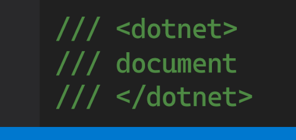
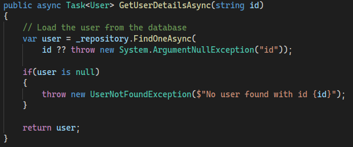
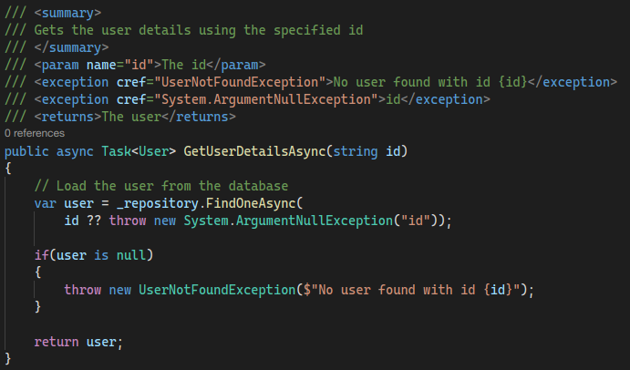

<p align="center">
  
</p>

# dotnet-document


[](https://www.nuget.org/packages/strategy) 
[](https://www.nuget.org/packages/strategy)


A cross platform tool that auto generates an XML doc starting point for your C# codebase.

Thanks to `Microsoft.CodeAnalysis.CSharp` this tool is able to identify undocumented members and to generate a meaningful XML doc by *humanizing* member names.

| **Before** | **After** |
|------------------------------------|---------------------------------|
|||

## Installation
The tool can be installed globally via Nuget by running 

```sh
dotnet tool install --global dotnet-document --version 0.1.4-alpha
```
> 👉 When installing pre releases the version has to be explicitly specified

## How to run

### Apply doc

To run the tool invoke `dotnet document apply`

```sh
# Documents all *.cs files in the current dir and all sub dirs 
dotnet document apply

# Documents the specified .cs file
dotnet document apply ./src/folder/MyClass.cs

# Documents all *.cs files in the specified dir and all sub dirs 
dotnet document apply ./src/folder/

# Documents all *.cs files in the specified solution
dotnet document apply ./src/solution.sln

# Documents all *.cs files in the specified project
dotnet document apply ./src/folder/project.csproj
```

### Dry run
To test the command without saving changes on disk a dry run option is available.

In case of undocumented members a non-zero exit code is returned so that it is possible to warn about it  during CI.
```sh
dotnet document apply --dry-run
```
## Configuration

The tool can be configured so that the generated XML documentation meets  the project guidelines.

### Default configuration

The default configuration is used when no config file specified.
It can be viewed by invoking 
```sh
dotnet document config --default
```

### Customizing configuration

To customize the configuration, simply save the default one somewhere and use your preferred editor to update it.

```sh
dotnet document config --default > ~/my-dotnet-document.yaml
```

Custom configuration path can be provided either by setting a `DOTNET_DOCUMENT_CONFIG_FILE` env variable or by passing the `-c` argument when calling the `apply` command. The latter overrides the first.

```sh
dotnet document apply \
  -c ~/my-dotnet-document.yaml \
  ./src/folder/
```
To double check which configuration is being used, invoke
```sh
dotnet document config
```

If you wish to exclude private members, properties, or methods modify your configuration file like:

```yaml
class:
  ...
  exclude_private: true
method:
  ...
  exclude_private: true
property:
  ...
  exclude_private: true
default_member:
  ...
  exclude_private: true

```

> 👉 Folder based configuration discovery is not yet supported

## Acknowledgments
* [Humanizer](https://github.com/Humanizr/Humanizer) - Used for humanizing member names
* [Ensure.That](https://github.com/danielwertheim/Ensure.That) - Used as a guard clause
* [FluentAssertions](https://fluentassertions.com/) - Used for wrinting better assertions
* [Moq4](https://github.com/Moq/moq4) - A mocking library for easier testing
* [xUnit](https://github.com/xunit/xunit) - The test framework
